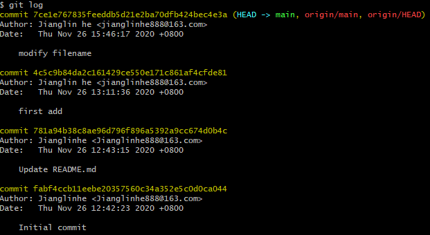

## Git 操作手册

### 1. git简介

Git是**分布式**版本控制系统，有强大的**分支管理**

**版本控制：**记录一个或若干文件内容的变化，以便将来查阅特定版本修订情况的系统，方便查看更改历史，备份以及恢复以前的版本，保证多人的协作不出问题。

**集中式版本控制**

​		版本库是集中存放在中央服务器的，而干活的时候，用的都是自己的电脑，所以先要从中央服务器取得最新的版本，然后再干活，干完活后，再把自己的活推送给中央服务器。


​		集中式版本控制系统的最大缺点：必须联网才能工作，如果在局域网内还好，带宽够大，速度够快，可如果在互联网上，遇到网速慢，可能提交一个10M的文件就需要5分钟。

**分布式版本控制系统**

​		分布式版本控制系统没有"中央服务器"，每个人的电脑上都是一个完整的版本库。既然每个人电脑上都有一个完整的版本库，那多个人如何协作呢？比方说你在自己电脑上改了文件A，你的同事也在他的电脑上改了文件A，这时，你们俩之间只需把各自的修改推送给对方，就可以互相看到对方的修改了。

​		在实际使用分布式版本控制系统的时候，其实很少在两个人之见的电脑上推送版本库的修改。分布式版本控制系统中也有一台充当"中央服务器"的电脑，但这个服务器的作用仅仅是用来方便"交换"大家的修改，没有它，大家也一样干活，只是交换修改不方便而已。


**每次提交更新，或在git中保存项目状态时，它主要对当时的全部文件制作一个快照并保存这个快照的索引**

**SVM不适合的领域：**

- 跨地域的协同开发
- 对代码的高质量追求和代码门禁

**Git不适合的领域：**

- 不适合Word等二进制文档的版本控制

  因为：Git无锁定/解锁模式，故不能排他式修改

- 整体的读授权，不能将读授权精细到目录级别

  解决方案：版本库按照目录拆分

**版本控制工具的发展历史：**

1. 原始人工维护状态
2. 本地RCS
3. 集中式，如CVS、SVN
4. 分布式，如Git

**集中式和分布式的区别:**

- 集中式版本控制工具，几乎所有的动作都需要服务器参与，并且数据安全性与服务器关系很大
- Git是分布式版本控制工具，除了与服务器之间进行按需同步外，所有的提交操作都不需要服务器

### 2. git安装

git最早是在linux上开发的，很长一段时间内，现在git可以在linux、unix、mac、windows上运行。

- 在**windows**上安装

  直接从Git官网上下载安装程序，然后默认选项安装即可。

  安装完成后，还需要设置，在git bash命令窗口中输入:

  ```bash
  # 因为git是分布式版本控制系统，因此，没台机器都必须自报家门:你的名字和Email地址
  git config --global user.name "Jianglinhe"
  git config --global user.email "Jianglinhe888@163.com"
  ```

  <font color='red'>```git config```</font>命令的<font color='red'>```--global```</font>参数，表示这台机器上所有的git仓库都会使用这个配置，当然也可以对某个仓库指定不同的用户名和Email地址

  ```bash
  # 获取config信息
  git config --list
  ```

- 在**Linux**上安装

  ```bash
  sudo apt-get install git
  ```

### 3. git本地操作

 **版本库**，又名**repository**，可以理解成一个目录，这个目录里所有文件都可以被git管理起来，每个文件的修改、删除，Git都能跟踪，以便任何时刻都可以追溯历史，或者在将来某个时刻可以还原。

#### 基本配置

> Git有三种配置，分别以文件的形式存放在三个不同的地方。可以使用git config工具查看这些变量

**系统配置（对所有用户都适用）**

存放在git的安装目录下:``` %Git%/etc/gitconfig```：若使用git config 时用--system 选项，读写的就是这个文件：

```git config --system core.autocrlf```

**用户配置(只适用于该用户)**

存放在用户目录下。例如Linux存放在:```~/.gitconfig```: 若使用git config 时用 --global选项，读写的就是这个文件:

```git config --global user.name```

**仓库配置(只对当前项目有效)**

当前仓库的配置文件(也就是工作目录中的```.git/config```文件)：若使用git config时用--local选项，读写的就是这个文件：

```git config --local remote.origin.url```

**注：**每一个级别的配置都会覆盖上层的相同配置

**配置个人身份**

首次的Git设定(设定身份，自己做主)

```git config --global user.name "HeZhiQiang"```

```git config --global user.email jianglinhe888@163.com```

这个配置信息会在Git仓库中提交的修改信息中体现，但和Git服务器认证使用的密码或公钥密码无关。

**文本换行符配置**

---

假如你正在Windows上写程序，又或者你正在和其他人合作，他们在Windows上编程，而你却在其他系统上，在这些情况下，你可能会遇到**行尾结束符问题**。这是因为Windows使用回车和换行两个字符来结束一行，而Mac和Linux只使用换行一个字符。虽然这是小问题，但他会极大干扰跨平台协作。

----

```CRLF```:回车换行。```CR```：即平常说的\r，回车。```LF```：即\n，换行。

Windows下换行符为```CRLF```，Linux下用```LF```

Git服务器一般是部署在Linux上的

---

**业务背景：**git客户端在windows下环境，在默认配置下，在检出与检入时，行尾换行符会做相关转换。在windows下写的代码，提交仓库时，行尾的换行符```CRLF```会转换为```LF```。但是测试人员用的也是windows，git默认配置，拉下来转换为```CRLF```。将这个脚本上传到服务器执行就会出问题，格式不正确，报错类似结束符不正确：\r之类的。

**期望:**不发生转换，测试任务下载下来的时候换行符就是```LF```，上传到Linux执行没问题。

**解决办法:**

1. 提交时```CRLF```转换成```LF```,签出代码时转换成```CRLF```

   在windows系统上，将```core.autocrlf```设置为true

   ```git config --global core.autocrlf ture```

2. <font color='red'>提交时```CRLF```转换为```LF```，签出时不转换</font>

   ```git config  --global core.autocrlf input```

3. 如果是windows程序员，且正在开发仅运行在windows上的项目，可以设置为false

   ```git config --global core.autocrlf false```

**文本编码配置**

- ```i18n.commitEncoding```选项：用来让git commit log存储时，采用的编码，默认UTF-8
- ```i18n.logOutputEncoding```选项：查看git log时，显示采用的编码，建议设置为UTF-8

```bash
# 中文编码支持
git config --global gui.encoding utf-8
git config --global i18n.commitencoding utf-8
git config --global i18n.logoutputencoding utf-8
# 显示路径中的中文
git config --global core.quotepath false
```

**与服务器的认证配置**

- http/htpps协议认证

  ```bash
  # 设置口令缓存
  git config --global credential.helper store
  # 添加HTTPS证书信任
  git config http.sslverify false
  ```

- ssh协议认证

  SSH协议是一种常用的Git仓库访问协议，使用公钥认证、无需输入密码，加密传输，操作便利又保证安全性

**ssh认证的配置过程**

1. **生成公钥**

   ```ssh-keygen -t rsa -C jianglinge888@163.com```

2. **添加公钥到代码平台**

   - 登录代码平台
   - 点击左侧栏的"SSh Keys"
   - 点击"Add SSH Key"，将刚生成的公钥文件```id_rsa.pub```的内容，复制到"Public Key"保存，即可。

#### 三种工作区域和文件状态

---

**Git版本控制下的工程区域只有三种:**

1. 版本库(Repository)

    在工作区中有一个隐藏的目录.git，这个文件夹就是Git的版本库，里面存放了Git用来管理该工程的所有版本数据，也可以叫本地仓库。

2. 工作区(Working Directory)

   日常工作的代码文件或者文档所在的文件夹

3. 暂存区(stage)

   一般存放在工程根目录.git/index文件中，也将暂存区叫做索引(index)

---

**Git版本控制下的文件只有三种状态:**

1. 已提交(committed)

   该文件已经被安全的保存在本地数据库中

2. 已修改(modified)

   修改了某个文件，但还没有提交保存

3. 已暂存(staged)

   把已修改的文件放在下次提交时要保存的清单中

---

#### 3.1 工程准备

1. 新建一个空目录

   ```bash
   mkdir c_learn
   ```

2. 初始化仓库，将这个目录编程git可以管理的仓库

   ```bash
   # cd c_learn
   git init
   ```

   当前目录下会多一个``.git``的目录(默认隐藏的)，这个目录是git用来跟踪管理版本库的，不要手动修改这个目录文件。

#### 3.2 将文件添加到版本库

所有的版本控制系统，其实只能跟踪文本文件的改动，比如:txt文件，网页，所有的程序代码等等。

编写一个<font color='red'>```readme.txt```</font>文件，不要使用记事本(容易出现编码问题，建议notepad++)，内容为说明文档

该文件放到```c_learn```目录下，然后

```bash
# 1.使用 git add 将文件添加到暂存区
git add readme.txt 
git add . # 可以将所有待添加的文件都进行添加
# 2.使用 git commit 告诉git，把文件提交到仓库
git commit -m "wrote a readme file"
```

```bash
# 一次性提交所有暂存区改动的文件到版本库
git commit -am "commit message"
# -am 实际上是 -a -m的缩写
```

```bash
# 如果上次commit时备注的信息太少，想要修改
git commit --amend
# 会进入vim模式，可以对最后一次提交的信息进行重新修改备注
```

#### 3.3 查看工作区状态

```bash
git status
```

```git status```告诉你哪些文件被修改过

- 状态1: 修改了，没有添加到缓冲区(红色)
- 状态2: 修改了，添加到了缓冲区(绿色)
- 状态3: nothing to commit, working tree clean

```bash
git diff
```

```git diff```就是查看difference，用于比较项目中任意两个版本(分支)的差异，也可以用来比较当前索引和上次提交间的差异。

```bash
# 在diff后面加--name-status参数，只看文件列表
git diff   --name-status
```

#### 3.4 版本回退(查看日志)

在工作中，可能会每次修改然后提交，可以通过```git log```来查看历史记录

```bash
# 显示从最近到最远的日志
git log
# 如果嫌输出的信息太多，可以加上 --pretty=oneline参数
git log --pretty=oneline
git log -3 # 显示最近的三条记录
git log --name-status # 可以查看更多信息
```



> commit后面一大串是```commit id```(版本号)

**退回版本**(撤销提交节点)

在git中，用<font color='green'>```HEAD```</font>表示当前版本，也就是最近一次提交的那个版本，上一个版本就是<font color='green'>```HEAD^```</font>，上上一个版本就是<font color='green'>```HEAD^^```</font>，往上100个版本就是<font color='green'>```HEAD~100```</font>

```bash
# 退回到上一个版本
git reset --hard HEAD^ 
```

此时，已经退回到了上一个版本，使用```git log```已经看不到未来的那个版本了，如果穿梭回去，只要上面的命令窗口没有关闭，就可顺着往上找

```bash
git reset --hard 未来版本号(版本号没必要写全，前几位就可以了)
```

如果关掉了窗口，git提供了```git reflog```来记录每一条命令，可以用过该命令查看记录

**总结**

- ```HEAD```指向的版本就是当前版本，因此，Git允许我们在版本的历史之间穿梭，使用命令```git reset --hard commit_id```
- 穿梭前，使用```git log```可以查看提交历史，以便确定要回退到哪个版本
- 要重返未来，用```git reflog```查看历史命令，以便确定要回到哪个未来的版本

#### 3.5 工作区和暂存区

**工作区**

​		就是电脑中能看到的目录，比如:c_learn(不包括隐藏目录)

**版本库**


​		工作区一次隐藏目录```.git```，就是git的版本库。版本库有很多东西，最重要的就是称为stage(或叫index)的暂存区，还要git自动创建的第一个分支```master```，以及指向```master```的一个指针叫```HEAD```

**往git库添加文件的本质**

- ```git add```，实际上就是把文件修改添加到缓冲区
- ```git commit```，实际上就是把暂存区的所有内容提交到当前分支

#### 3.6 管理修改

理解其概念，git跟踪管理的是修改，而非文件

#### 3.7 撤销修改

> 用于回退本地所有修改而未提交的文件内容(**谨慎使用**)

```bash
git checkout -- filename
```

- 一种是```file```自修改后还没有被放到暂存区，现在，撤销修改就回到和版本库一模一样的状态
- 一种是```file```已添加到暂存区，又做了修改，现在，撤销修改就回到添加暂存区后的状态。
- 总之，就是让文件回到最近一次```git commit```或```git add```时的状态

#### 3.8 删除文件

```bash
# 1.先在文件管理器里直接将文件删除
rm file
# 2.查看此时的状态，工作区和版本库不一致，会发现哪些文件被删除了
git status
# 3. 从版本库中删除文件
git rm file
git commit -m "删除备注信息"
```

【tip】先手动删除文件，然后使用```git rm file```和```git add file```效果一样

如果是厝山文件，而版本库里还有，可以轻松的将误删文件恢复到最新版本

```bash
git checkout -- filename
# 其实就是用版本库里的版本替换工作区的版本，无论工作区是修改还是删除，都可以一键还原
```

#### 3.9 移动文件

```bash
# 用于移动文件，也可以用于重命名文件
git mv
```

### 4. 远程仓库

**使用github作为git服务器**

- 创建SSH Key

  ```bash
  ssh-keygen -t rsa -C "youremail@example.com"
  ```

  在git bash使用上述命令，会生成两个目录，```id_rsa```和```id_rsa.pub```，这是一对秘钥，前者是私钥，后者是公钥。

- 登录github，打开"Account settings"，"SSH Keys"页面，点"Add SSH Key"，填上任意title，在Key文本框里粘贴```id_rsa.pub```文件的内容保存即可

> Github允许添加多个key

#### 4.1 添加远程仓

如果你**已经在本地创建了一个Git仓库后，又想在Github创建一个Git仓库，并且让这两个仓库进行远程同步**。

<font color='red'>**先有本地仓，后有远程仓**</font>

- 登录github，创建新的仓库，"Create a new repo"

- 在本地仓库下运行命令

  ```bash
  git remote add origin git@github.com:Jianglinhe/仓库名.git
  ```

- 将本地仓的内容推送到远程

  ```bash
  git push -u origin master
  ```

  远程仓库的名字默认就是```origin```，这是git默认叫法。```git push```命令，实际上是把当前分支```master```推送到远程，由于远程仓库是空的，第一次推送```master```分支时，加上```-u```参数，会将本地```master```和远程```master```分支关联起来，后续的推送或拉取可以简化命令

  ```bash
  # 后续简化推送命令
  git push origin master
  ```
  
  【注意】github默认分支名master已更改为main分支，导致推送命令更改为
  
  ```bash
  # 将master分支替换为main分支
  git push origin main
  ```

#### 4.2 从远程库克隆(方便)

<font color='red'>**先建远程库，再从远程库克隆**</font>

```git clone ```**用于克隆远端工程到本地磁盘**

- 在github上新建一个仓库，注意勾选```Initialize this repository with a README```

- 使用```git clone```命令进行克隆

  ```bash
  git clone git@github.com:Jianglinhe/CPlusPlus.git
  ```

  github给出的地址不止一个，因为git支持多种协议，默认使用ssh协议(最快)，还可以使用https协议

**注:**如果你所在的项目git服务器一直吃```git-lfs```，对二进制文件进行了区别管理，那么克隆工程的时候务必使用```git lfs clone```。否则克隆操作无法下载到工程中的二进制文件，工程内容不完整。

---

**克隆项目前：**问清楚git项目的管理员，该项目支不支持```git-lfs```

---

**推送到远端仓库**

```bash
git push origin branch_name
```

### 5.分支管理

#### 5.1 查看分支名称

```bash
# 查看本地工程所有的分支名称，"*"表示--当前工作区所在的分支
git branch
```

```bash
# 查看远端服务器上拥有哪些分支
git branch -r
```

```bash
# 查看远端服务器和本地工程所有的分支
git branch -a
```

#### 5.2 分支管理

- 新建分支

```bash
# 新建分支，但不会切换到新分支
git branch new_branch_name
```

```bash
# 新建分支，并自动切换到新分支
git checkout -b new_branch_name
```

- 切换分支(官方叫法：**检出**)

```bash
# 切换到另一个已有分支
git checkout branch_name
```

```bash
# 强制切换(当前分支工作区存在修改而未提交的文件，与目的分支上的内容冲突，会导致checkout切换失败)
git checkout -f branch_name
```

- 删除分支

```bash
# 删除本地分支
git branch -d branch_name
git branch -D branch_name # 强制删除
```

```bash
# 删除服务器上的远程分支，branch_name为本地分支名
git branch -d -r branch_name
# 删除后，还要推送到服务器上才行
git push origin : branch_name
```

- 更新本地分支

> ```git pull ```的作用：从远端服务器获取某个分支的更新，再与本地指定的分支进行自动合并

```bash
git pull origin remote_branch_name:local_branch_name
```

```bash
# 如果远程指定的分支名和本地指定的分支名相同，则可直接执行
git pull origin remote_branch
```

> ```git fetch```的作用：从远端服务器中获取某个分支的更新到本地仓库(**相对更加安全**)

**注：**与git pull不同，git fetch在获取更新后，并不会进行合并，这样留给用户一个操作空间，确认git fetch内容符合预期后，再决定是否手动合并节点(git merge)

```bash
git fetch origin remote_branch_name:local_branch_name
```

```bash
# 如果远程指定的分支名和本地指定的分支名相同，则可直接执行
git fetch origin remote_branch
```

- 分支合并

> **git merge**命令是用于从指定的分支(节点)合并到当前分支的操作

> git会将指定的分支与当前的分支进行比较，找出两者最近的一个共同节点base，之后将指定分支在base之后分离的节点合并到当前分支上。分支合并，实际上是分支间差异提交节点的合并。

```bash
git merge branch_name
```


> **git rebase**用于合并目标分支内容到当前分支

> 如果要将其他分支的提交节点合并到当前分支，那么git rebase和git merge都可以达到目的

```bash
git rebase branch_name
```


**注：**```git merge```和```git rebase```背后的实现机制和对合并节点造成的影响有很大差异，有各自存在的风险。

[分支管理教程地址](https://www.liaoxuefeng.com/wiki/896043488029600)

